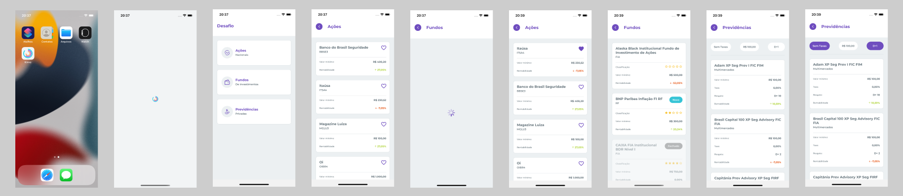

<h1 align="center">
  Kinvo
</h1>

## :rocket: Como executar

<ul>
  <li>Clonar o projeto</li>
  <li>Entrar pasta na raiz e se estiver na branch <strong>master</strong> entrar na branch <strong>luis-esculapio</strong> com o comando <strong>git checkout luis-esculapio</strong></li>
  <li>Instalar as depêndencias usando <strong>yarn</strong></li>
  <li><strong>iOS:</strong> instalar pod install, <strong>cd ios && pod install && cd ..</strong></li>
  <li>Executar comando <strong>yarn start</strong> no diretório raiz</li>
  <li>Em outro terminal, também no diretório raiz, executar <strong>yarn android</strong> ou <strong>yarn ios</strong> dependendo da plataforma</li>
</ul>

## :speech_balloon: Funcionalidades

<ul>
  <li>Navegação entre telas</li>
  <li>Favoritar conteúdo</li>
  <li>Filtragem de conteúdo</li>
</ul>

## :iphone: Recursos Aplicados

<ul>
  <li>Navegação entre páginas</li>
  <li>Async Storage</li>
  <li>Criação de componentes com Styled Components</li>
  <li>Consumo de API</li>
</ul>

## ⌨️ Tecnologias

<ul>
  <li>React Native</li>
  <li>TypeScript</li>
  <li>React Navigation</li>
  <li>React Native Splash Screen</li>
  <li>React Native SVG</li>
  <li>Styled Components</li>
  <li>Axios</li>
</ul>
